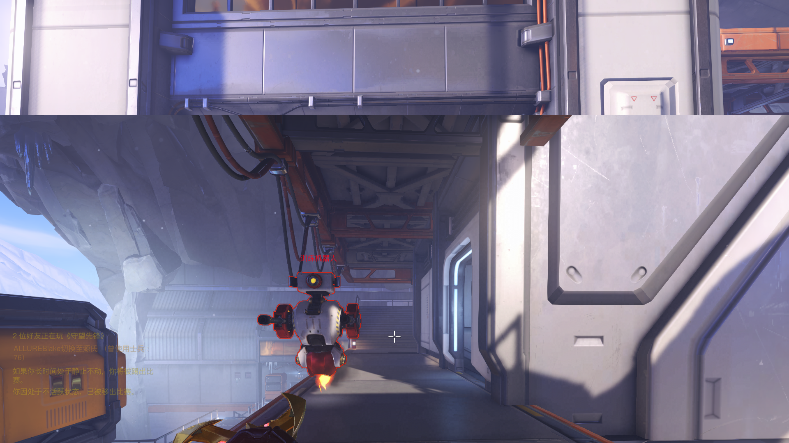

# Ive-got-you-in-my-sight
it is a automatic aiming system for the Overwatch. The program overwatch the screen to find the enermy target.
## the main idea is to divided into three steps down there:
1. get the image from the current display
2. transport the image to image processing engine
3. process the image with the engine(algo is the easy&interesting part in this project)
### FRONT END
plan to use C# to get real-time image of the game.
### TRANSPORT
actually I haven't got an idea of how to transport the data from the front end to the backend.
### BACK END
using Go.

- because all the enermy have a red outline around them, I decide to find all this kind of red in the image ( hope there won't be too many in the model ).
- and find the center point for all the red pixels ( I hope I can do it without a lot of calculation ).
- return the point (x,y) to the front end.

## Update 3/11/2017
The backend worked. 

The origin screenshot looks like:

After the process, it looks like:

Then we can aim:

